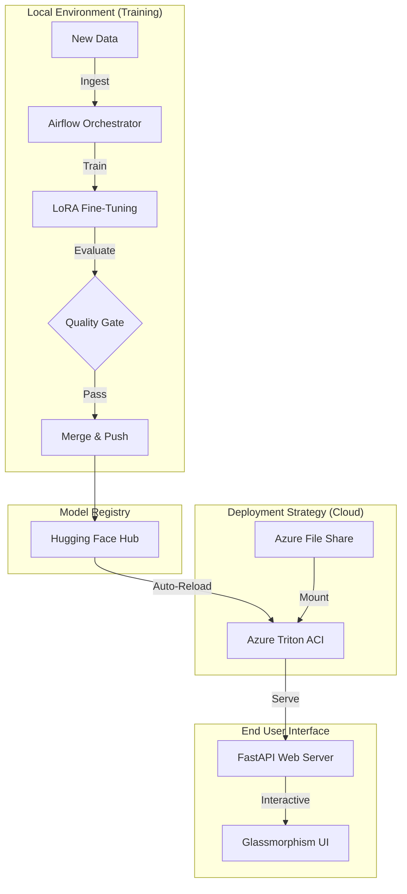

# 🚀 StackOverflow Assistant: Full-Stack MLOps & serving System

A production-grade **Self-Improving AI System** that continuously fine-tunes a Large Language Model (DeepSeek Coder) on new domain-specific data, evaluates its quality, and automatically deploys it for high-performance inference on **Azure Cloud** or local infrastructure.


---

## ✨ Key Features

### 🎨 Premium User Experience
- **Modern UI**: Sleek glassmorphism design with deep blue/purple aesthetics.
- **ChatGPT-style Sidebar**: Collapsible history pane for managing conversations.
- **Chat Persistence**: Automatic local history saving (localStorage) with delete/load capabilities.
- **Thinking State**: Visual pulse animations while the AI generates responses.
- **Identity**: Fully branded as **StackOverflow Assistant**.

### 🕒 Automated MLOps Pipeline (Airflow)
- **Continuous Ingestion**: Automatically pulls and processes new data.
- **LoRA Fine-Tuning**: Efficient training using Low-Rank Adaptation (Peft).
- **Quality Gate**: Automatic evaluation using **BLEU** and **BERTScore**; only "good" models proceed.
- **Zero-Downtime Reload**: Integrated `reload_triton` task that pings the server (Local or Azure) to swap in the new brain instantly after deployment.

### ☁️ Cloud & Hybrid Deployment
- **Azure ACI**: Automated deployment to **Azure Container Instances**.
- **Integrated ACR**: Private storage for the Triton Docker image in **Azure Container Registry**.
- **Managed Storage**: Azure File Shares for persistent model weights.
- **Flexible Serving**: Graceful fallbacks between **Triton (Docker/Azure)** -> **Local Inference (Python)** -> **Mock Mode**.

---

## 🏗️ Architecture



---

## 🚀 Getting Started

### Prerequisites
- **Azure CLI**: Logged in (`az login`).
- **Docker**: For local Airflow and Triton testing.
- **Hugging Face Token**: Read/Write access (stored in `.env`).
- **Python 3.10+**: For the web server and training scripts.

### 📦 1. Installation

```powershell
git clone https://github.com/MohammedAmine0012/Continuous-Fine-Tuning-Pipeline-for-LLMs-Airflow-HuggingFace-LoRA-.git
cd Continuous-Fine-Tuning-Pipeline-for-LLMs-Airflow-HuggingFace-LoRA-

# Setup virtual environment
python -m venv venv
.\venv\Scripts\activate

# Install dependencies
pip install -r requirements.txt
```

### ⚙️ 2. Configuration
Create/Update your `.env` file:
```env
HF_TOKEN=hf_your_token_here
HF_REPO_NAME=your_username/project_name
TRITON_HTTP_URL=http://20.40.151.160:8000  # Set your Azure IP or localhost
```

---

## 🏃 How to Run

### A. Start the Pipeline (Airflow)
This runs the full automation loop.
```bash
docker-compose up -d
```
- **UI**: http://localhost:8085 (Username: `airflow`, Password: `airflow`)
- **Action**: Enable and Trigger the `continuous_finetune` DAG.

### B. Start the Chat Web UI
This starts the StackOverflow Assistant frontend.
```bash
python -m uvicorn src.web_server:app --port 8080 --reload
```
- **UI**: http://127.0.0.1:8080

### C. Deploy to Azure (Cloud Triton)
To move your inference server to the cloud, use the provided deployment commands:
1. **Push Image**: `docker push mytritonregistry.azurecr.io/triton-custom:latest`
2. **Setup Storage**: Create Storage Account & File Share `model-repo-share`.
3. **Run ACI**: 
   ```powershell
   az container create --resource-group YOUR_RG --name triton-server --image YOUR_ACR_IMAGE --ip-address Public --os-type Linux ...
   ```

---

## 📂 Project Structure

| Directory/File | Description |
| :--- | :--- |
| `airflow_dags/` | The "Brain" of the automation. |
| `src/web_server.py` | FastAPI server with multi-mode inference logic. |
| `webui/` | Premium HTML/CSS/JS frontend. |
| `model_repository/` | Triton configurations and load scripts. |
| `src/pipeline_settings.py`| Central config for Airflow. |

---

## 📄 License
MIT License. Free to use and modify for personal and commercial use.
